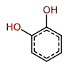
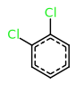
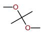
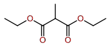
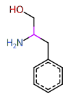
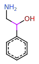
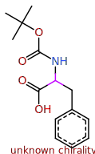
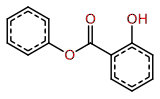

## 10_Beginner

| Exercise | Correction |
|----------|------------|
| 01 |  |
| 03 |  |
| 07 |  |
| 14 |  |
| 27 |  |
| 29 |  |
| 30 |  |
| 33 |  |
| 40 |  |
| 46 |  |
| 50 |  |
| 62 |  |
| 64 |  |

## 20_Intermediate

| Exercise | Correction |
|----------|------------|
| 02 |  |
| 04 |  |
| 05 |  |
| 06 |  |
| 08 |  |
| 09 |  |
| 10 |  |
| 11 |  |
| 12 |  |
| 15 |  |